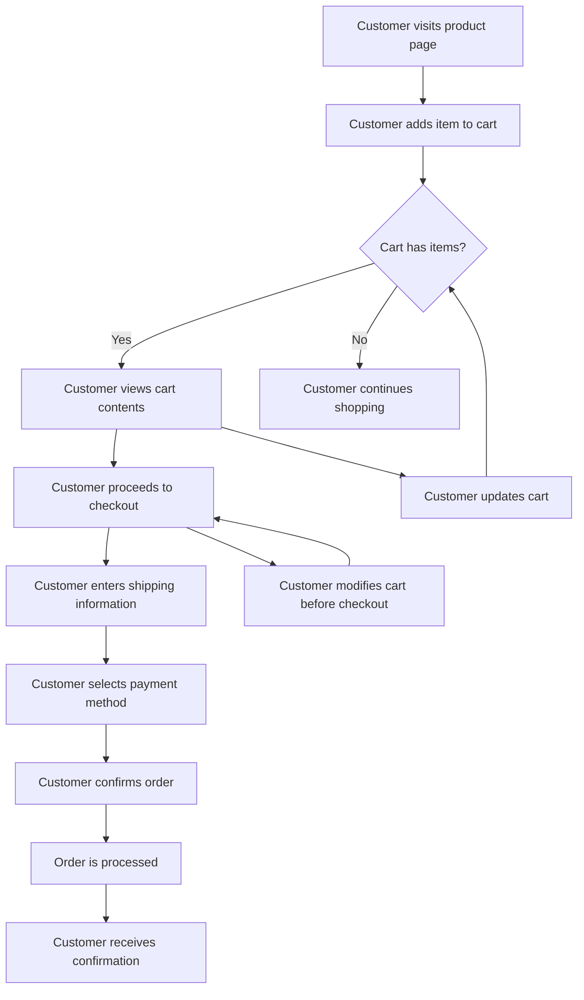

```mermaid
flowchart TD
    A[Customer visits product page] --> B[Customer adds item to cart]
    B --> C{Cart has items?}
    C -->|Yes| D[Customer views cart contents]
    C -->|No| E[Customer continues shopping]
    D --> F[Customer proceeds to checkout]
    F --> G[Customer enters shipping information]
    G --> H[Customer selects payment method]
    H --> I[Customer confirms order]
    I --> J[Order is processed]
    J --> K[Customer receives confirmation]
    D --> L[Customer updates cart]
    L --> C
    F --> M[Customer modifies cart before checkout]
    M --> F
```